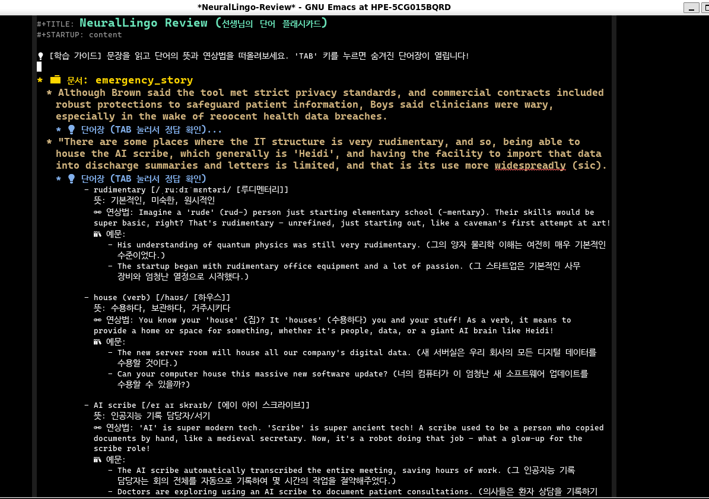

#+DESCRIPTION: Emacs AI English Learning Assistant using Gemini 2.5 Flash

*NeuralLingo*는 Emacs 안에서 영어 텍스트를 읽을 때, 맥락 전환(Context Switching) 없이 즉각적으로 완벽한 AI 원어민 과외 선생님을 호출할 수 있는 영어 학습 어시스턴트입니다. This is using Emacs & Gemini 2.5 Flash for AI English Learning Assistant.

* 🌟 Introduction (소개 및 목적)
영어 기사나 기술 문서를 읽다 모르는 문장이나 단어가 나올 때, 번역기나 사전을 켜기 위해 웹 브라우저로 전환하는 것은 몰입을 심각하게 방해합니다.

*NeuralLingo*는 사용자가 읽고 있는 Emacs 버퍼 자체를 **학습장(Loci)**으로 만들어줍니다. 문장 위에서 단축키 하나만 누르면, 유쾌하고 친절한 AI 선생님이 문맥에 맞는 자연스러운 해석, 숨겨진 뉘앙스, 발음 꿀팁, 아재개그식 연상법(Mnemonic), 그리고 당장 써먹을 수 있는 실생활 예문을 우측 사이드 패널에 띄워줍니다.

#+CAPTION: NeuralLingo in action: Analyzing an English article
#+NAME: fig:demo-main
[[./img/Screenshot_2026-03-01_101131.png]]

- 좌측엔 영어 원문(일부 형광펜 하이라이트 됨), 우측엔 번역/단어/연상법이 예쁘게 렌더링된 패널

* ✨ Features (주요 기능)
- *On-Demand AI Analysis:* 문장 단위 심층 분석 (자연스러운 번역 + 격식/비격식 뉘앙스 팁).
- *Vocabulary Deep-Dive:* 억양/연음 발음 코칭, 어원 및 연상법(Mnemonic), 실생활 예문 2종 자동 생성.
- *Interactive Q&A:* 분석된 패널의 문맥을 기억하는 상태에서, 언제든 미니버퍼로 "여기서 이 단어 대신 ~를 쓰면 어때?" 등의 꼬리 질문 가능.
- *Context Continuity (학습 흔적 보존):* 분석이 끝난 문장은 본문에 은은한 네온 하이라이트로 남아, 나만의 오답 노트(형광펜) 역할을 합니다.
- *Auto Session Management:* 버퍼별로 질문과 분석 내역을 로컬 JSON 캐시로 자동 저장/불러오기.
- *Active Recall Review:* 저장된 모든 세션을 긁어모아 Org-mode 기반의 플래시카드로 자동 생성.

#+CAPTION: Q&A and Org-mode Flashcard Review
#+NAME: fig:demo-review

# 💡 스크린샷 팁: Q&A가 패널 밑에 누적된 모습이나, `C-c r`을 눌러 생성된 Org-mode 복습 버퍼(트리를 폈다 접었다 하는 모습)를 캡처하세요.

* 🚀 Installation & Setup (설치 및 설정법)

** 1. Requirements
- Emacs 27.1 이상 (내장 =json.el= 및 =url.el= 사용)
- [[https://aistudio.google.com/app/apikey][Google Gemini API Key]] (무료 티어 사용 가능)

** 2. Manual Installation
=neurallingo.el= 파일을 Emacs의 =load-path= 에 위치한 폴더(예: =~/.emacs.d/lisp/=)에 다운로드합니다.

** 3. Configuration (설정)
=init.el= 또는 =config.el= 파일에 아래와 같이 설정을 추가합니다.

#+BEGIN_SRC emacs-lisp
;; 1. 로드 패스 추가 (수동 설치 시)
(add-to-list 'load-path "~/.emacs.d/lisp/")
(require 'neurallingo)

;; 2. Gemini API 키 발급 및 입력 (필수)
(setq neurallingo-gemini-api-key "YOUR_GEMINI_API_KEY_HERE")

;; 3. (선택) 캐시 파일이 저장될 디렉토리 변경 (기본값: ~/.emacs.d/neurallingo/)
;; (setq neurallingo-cache-dir "~/.emacs.d/my-english-cache/")

;; 4. 글로벌 단축키 설정 (원하는 키로 변경 가능)
(global-set-key (kbd "C-c n m") 'neurallingo-mode)
#+END_SRC

** 4. Use-package를 이용한 설정 예시
#+BEGIN_SRC emacs-lisp
(use-package neurallingo
  :load-path "lisp/" ; 실제 경로에 맞게 수정하세요
  :custom
  (neurallingo-gemini-api-key "YOUR_GEMINI_API_KEY_HERE")
  :bind
  (("C-c n m" . neurallingo-mode)))
#+END_SRC

* ⌨️ Usage (사용 방법)

영어 텍스트 버퍼를 열고 =M-x neurallingo-mode= 를 실행하여 모드를 켭니다. 이후 아래 단축키들을 활용해 학습하세요.

| 단축키  | 명령어 | 설명 |
|---------|--------|------|
| =C-c a= | =neurallingo-analyze-current-sentence= | 커서가 위치한 문장을 분석하고 우측 패널에 렌더링 (형광펜 하이라이트 추가) |
| =C-c q= | =neurallingo-ask-question= | 패널에 분석된 문맥을 바탕으로 AI에게 꼬리 질문 던지기 |
| =C-c s= | =neurallingo-save-session= | 현재 문서(버퍼)에서 학습한 모든 분석 내역과 Q&A를 로컬에 영구 저장 |
| =C-c l= | =neurallingo-load-session= | 현재 버퍼 전용 세션을 불러오고 본문에 하이라이트 흔적 복원 |
| =C-c r= | =neurallingo-review= | 저장된 *모든* 세션을 모아 Org-mode 기반의 플래시카드(복습장) 버퍼 생성 |
| =C-c c= | =neurallingo-clear-all-highlights= | 현재 버퍼의 모든 학습 흔적 및 메모리 캐시 초기화 |

* 🎨 Customizing Faces (디자인 커스텀)
기본적으로 어두운 테마(Dark)와 밝은 테마(Light)에 맞춰 하이라이트 색상이 자동 지정되어 있습니다. 만약 색상을 바꾸고 싶다면 아래 코드를 활용하세요.

#+BEGIN_SRC emacs-lisp
(custom-set-faces
 '(neurallingo-highlight-face ((t (:background "#2d3748" :underline (:color "#4fd1c5" :style wave))))))
#+END_SRC

* 📜 License
This project is licensed under the MIT License.
