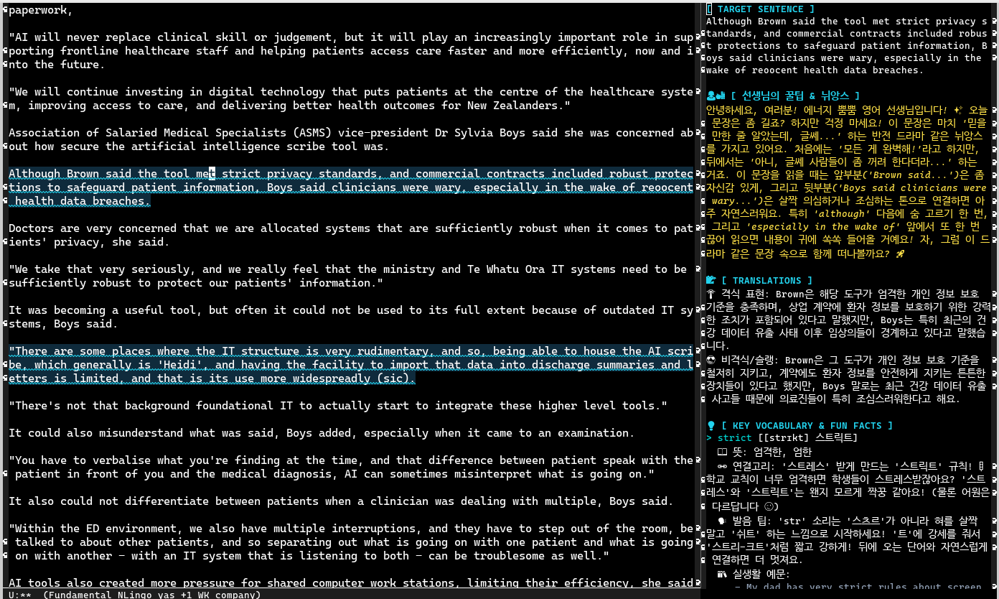

#+DESCRIPTION: Emacs AI English Learning Assistant using Google Cloud Vertex AI (Gemini)

*NeuralLingo*는 Emacs 안에서 영어 텍스트를 읽을 때, 맥락 전환(Context Switching) 없이 즉각적으로 완벽한 AI 원어민 과외 선생님을 호출할 수 있는 영어 학습 어시스턴트입니다. Google Cloud Vertex AI 기반의 Gemini 모델을 사용하여 더욱 안정적이고 심층적인 분석을 제공합니다.

* 🌟 Introduction (소개 및 목적)
영어 기사나 기술 문서를 읽다 모르는 문장이나 단어가 나올 때, 번역기나 사전을 켜기 위해 웹 브라우저로 전환하는 것은 몰입을 심각하게 방해합니다.

*NeuralLingo*는 사용자가 읽고 있는 Emacs 버퍼 자체를 **학습장(Loci)**으로 만들어줍니다. 문장 위에서 단축키 하나만 누르면, 유쾌하고 친절한 AI 선생님이 문맥에 맞는 자연스러운 해석, 숨겨진 뉘앙스, 발음 꿀팁, 아재개그식 연상법(Mnemonic), 그리고 당장 써먹을 수 있는 실생활 예문을 우측 사이드 패널에 띄워줍니다.

#+CAPTION: NeuralLingo in action: Analyzing an English article
#+NAME: fig:demo-main

* ✨ Features (주요 기능)
- *On-Demand AI Analysis:* 문장 단위 심층 분석 (자연스러운 번역 + 격식/비격식 뉘앙스 팁).
- *Vocabulary Deep-Dive:* 억양/연음 발음 코칭, 어원 및 연상법(Mnemonic), 실생활 예문 2종 자동 생성.
- *Interactive Q&A:* 분석된 패널의 문맥을 기억하는 상태에서, 언제든 미니버퍼로 추가 질문 가능.
- *Context Continuity:* 분석된 문장은 본문에 하이라이트로 남아 학습 흔적을 보존합니다.
- *Auto Session Management:* 버퍼별 학습 내역을 로컬 JSON 캐시로 자동 저장/불러오기.
- *Hierarchical Review (C-c r):* 저장된 모든 세션을 **세션 > 분석 문장 > 핵심 단어** 순의 3단계 계층 구조로 시각화하여 Org-mode 기반의 체계적인 복습 환경 제공.

* 🚀 Installation & Setup (설치 및 설정법)

** 1. Requirements
- Emacs 27.1 이상
- [[https://cloud.google.com/sdk/docs/install][Google Cloud SDK (gcloud CLI)]] 설치 및 인증 완료
  #+BEGIN_SRC bash
  gcloud auth application-default login
  #+END_SRC

** 2. Configuration (설정)
=init.el= 또는 =config.el= 에 아래 설정을 추가합니다.

#+BEGIN_SRC emacs-lisp
(require 'neurallingo)

;; Google Cloud 설정 (Vertex AI)
(setq neurallingo-project-id "your-project-id") ; 실제 GCP 프로젝트 ID
(setq neurallingo-location "us-central1")      ; 리전 설정
(setq neurallingo-model-id "gemini-2.5-flash") ; 사용 모델 ID

;; 글로벌 단축키 설정
(global-set-key (kbd "C-c n m") 'neurallingo-mode)
#+END_SRC

** ⚠️ Note for API Key Users (Legacy Version)
Google Cloud(Vertex AI) 설정 없이 **단순 API Key**만 사용하여 간편하게 학습하고 싶은 사용자는 [[https://github.com/incjjung/eng-elsip/tree/v3.0][v3.0 Release (Legacy)]] 버전을 사용해 주세요. v4.0부터는 더 강력한 문맥 분석을 위해 Vertex AI를 기본 엔진으로 사용합니다.

* ⌨️ Usage (사용 방법)

| 단축키  | 명령어 | 설명 |
|---------|--------|------|
| =C-c a= | =neurallingo-analyze-current-sentence= | 현재 문장 분석 및 하이라이트 추가 |
| =C-c q= | =neurallingo-ask-question= | 분석된 문맥 기반 AI 꼬리 질문 |
| =C-c s= | =neurallingo-save-session= | 현재 버퍼 학습 내역 로컬 저장 |
| =C-c l= | =neurallingo-load-session= | 저장된 세션 불러오기 및 하이라이트 복원 |
| =C-c r= | =neurallingo-open-reminder= | 세션/문장/단어 계층 구조의 Org-mode 복습장 생성 |
| =C-c c= | =neurallingo-clear-all-highlights= | 모든 학습 흔적 및 캐시 초기화 |

* 📜 License
This project is licensed under the MIT License.
